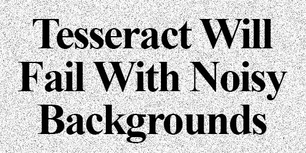

# open_cv

## Setup

- Clone (or download) the repository:
```ShellSession
git clone git@github.com:Paulinakhew/open_cv.git
```

- Download all the necessary packages:

* **MacOS Users**
```ShellSession
$ pip3 install -r requirements.txt
$ brew install tesseract
```

* **Ubuntu Users**
```ShellSession
$ pip install -r requirements.txt
$ sudo apt-get install tesseract-ocr
```

## Testing Pytesseract on Clean Example Files
The Pytesseract that we are testing below is the one downloaded using `homebrew`/`sudo apt-get install` and not the one from `pip`. The results will be printed to the terminal.

### Example 1


```ShellSession
$ tesseract tesseract_inputs/example_01.png stdout
```
This should output `Testing Tesseract OCR`

### Example 2


```ShellSession
$ tesseract tesseract_inputs/example_02.png stdout
```
This should output `PyImageSearch`

### Example 3


```ShellSession
$ tesseract tesseract_inputs/example_03.png stdout
```
This should output `650 3428`

## Testing Pytesseract on Noisy Example Files
The results will be printed to the terminal.


|  | Tesseract | ocr.py file |
|--|-----------|-------------|
| Run | `$ tesseract images/example_01.png stdout` | `$ python3 ocr.py --image images/example_01.png` |
| Result | Noisyimage<br>to test<br>Tesseract OCR | Noisy image<br>to test<br>Tesseract OCR |


|  | Tesseract | ocr.py file |
|--|-----------|-------------|
| Run | `$ tesseract images/example_02.png stdout` | `$ python3 ocr.py --image images/example_02.png --preprocess blur` |
| Result | _ Tesseract Will<br>Fail With Noisy<br>_ Backgrounds — | Tesseract Will<br>Fail With Noisy<br>Backgrounds |


|  | Tesseract | ocr.py file |
|--|-----------|-------------|
| Run | `$ tesseract images/example_03.png stdout` | `$ python3 ocr.py --image images/example_03.png` |
| Result | In order to make the most of this, you will need to have<br>alittle bit of programming experience. All examples in this<br>book are in the Python programming language. Familiarity<br>with Python or other scripting languages is suggested, but<br>not required.<br><br>You'll also need to know some basic mathematics. This<br>book is hands-on and example driven: lots of examples and<br>lots of code, so even if your math skills are not up to par,<br>do not worry! The examples are very detailed and heavily<br>documented to help you follow along. | In order to make the most of this, you will need to have<br>alittle bit of programming experience. All examples in this<br>book are in the Python programming language. Familiarity<br>with Python or other scripting languages is suggested, but<br>not required.<br><br>You'll also need to know some basic mathematics. This<br>book is hands-on and example driven: lots of examples and<br>lots of code, so even if your math skills are not up to par,<br>do not worry! The examples are very detailed and heavily<br>documented to help you follow along. |
